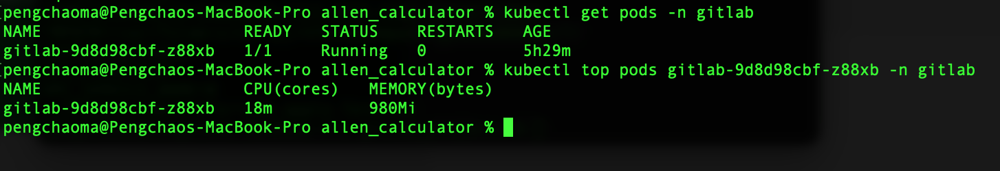
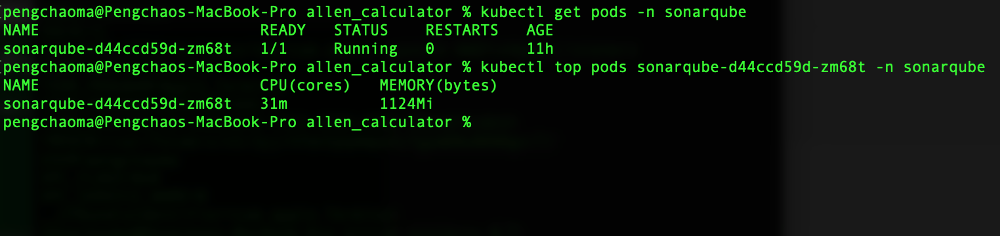
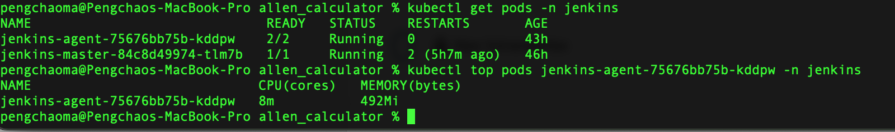
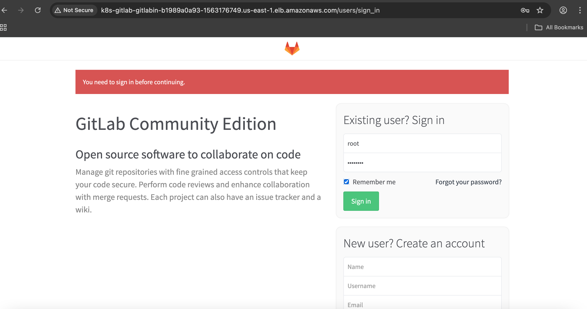
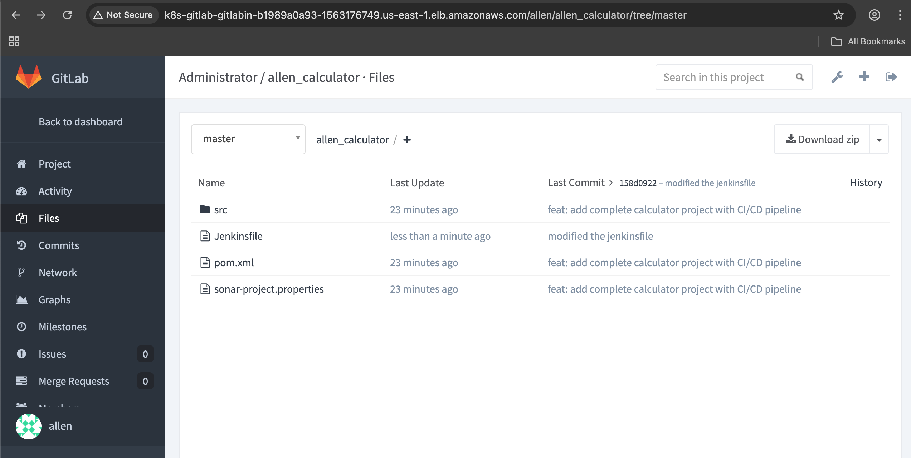
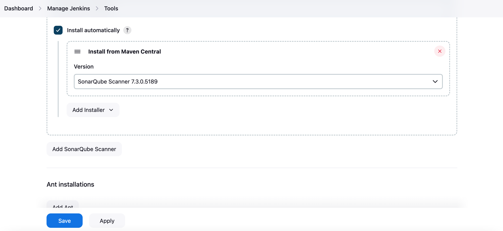
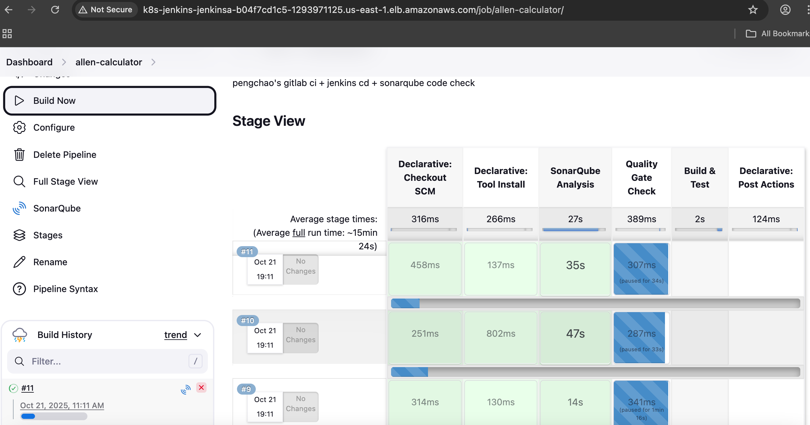
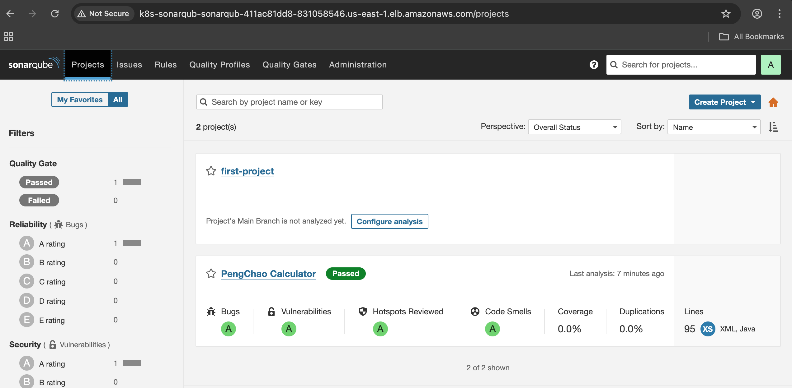
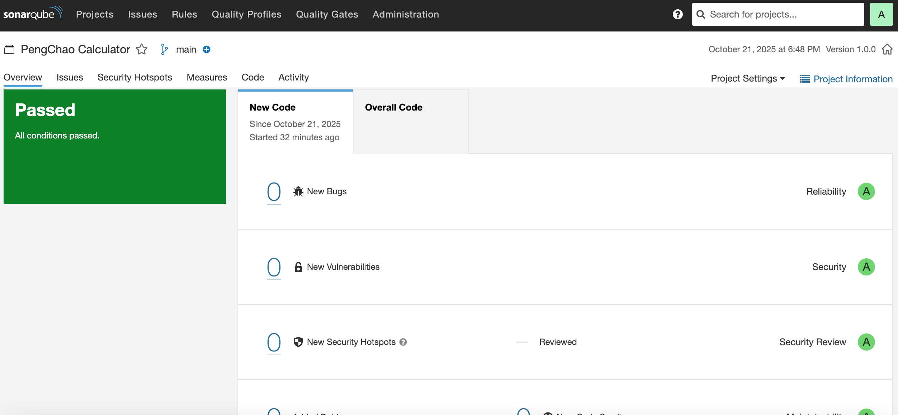

# GitLab-Sonarqube-Jenkins-EKS

In this demo, I will show you a complete gitlab CI jenkins CD and Sonarqube for code quality check ,All the service are running on AWS EKS.

## Features

- Gitlab running on EKS pod with an ALB for client access

     - AWS Elasticache(redis) for a high performance for gitlab
     - Postgresql for gitlab an isolated database(Running on  EKS)

- Sonarqube running on EKS pod with an ALB for client access

     - Since I don't have enough memory on EKS so Sonarqube use built in databse

- Jenkins running on EKS pod with an ALB for client access

     - one master pod
     - one agent pod 
        - agent pod with a sidecar Docker in Docker DinD container

- All the pod with PVC attached 

     - AWS storageclass gp3
     - AWS ebs csi driver and controller

## Usage

- For the Gitlab pod running in EKS

- Sonarqube pod running in EKS

- Jenkins I have written in my last repo and here's the pod

- GitLab index page

- GitLab repository overview

- Jenkins Add Sonarqube Server

- Jenkins pipeline with Sonarqube code check

- Sonarqube Projects overview

- Sonarqube code report

- Designed and Developed by Ma Pengchao @2025